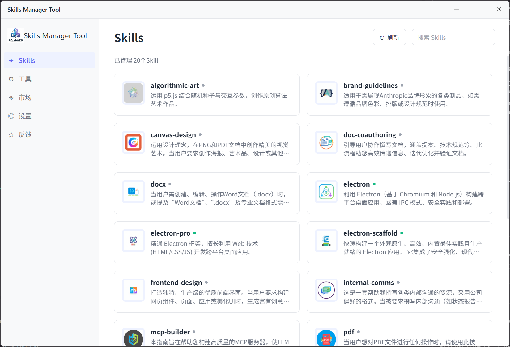
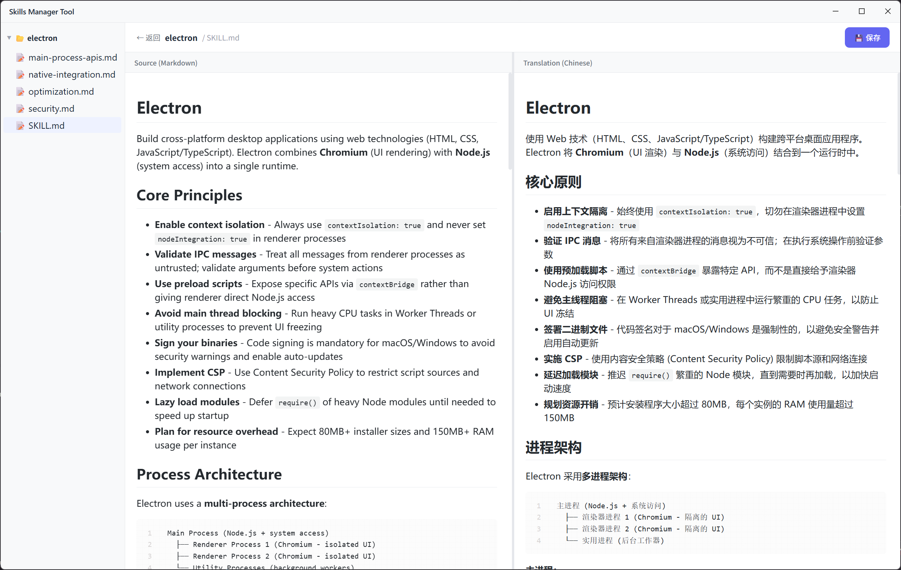
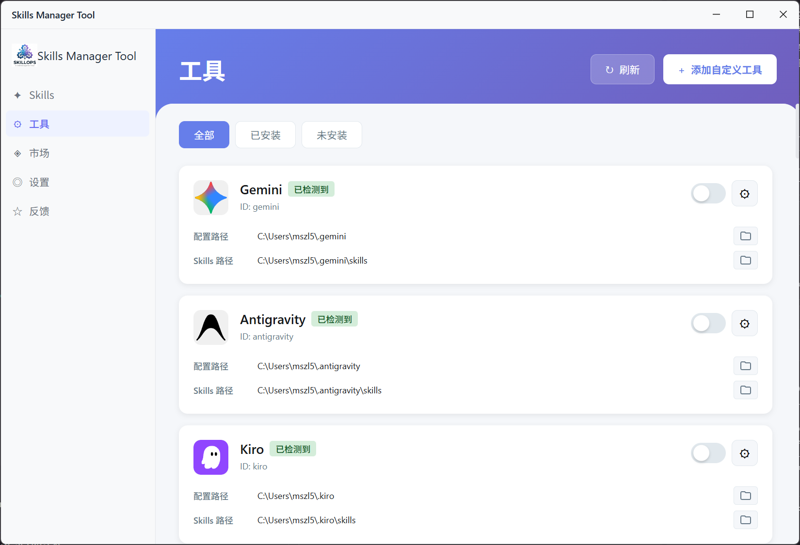
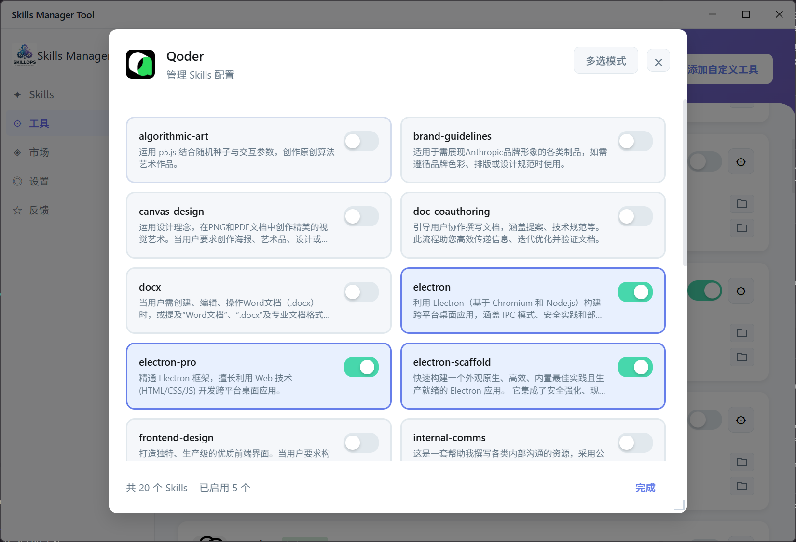

# Skills Manager Tool

<div align="center">


**A Modern Skills Management Tool for AI Coding Assistants**

[](https://opensource.org/licenses/MIT)
[](https://www.electronjs.org/)
[](https://vuejs.org/)
[](https://www.typescriptlang.org/)

English | [简体中文](README.md)

</div>

## 📖 Introduction

Skills Manager Tool is a specialized management tool designed for AI coding assistants (such as Kiro, Qoder, Cursor, Cline, etc.). It provides an intuitive graphical interface to help developers easily manage, edit, and distribute skill configurations for AI coding assistants.

## 🎯 Core Pain Points Solved

### 1. 📚 Skills Are All in English, Translation Is Cumbersome

- **Problem**: Most AI coding assistant Skills documentation is in English, making it difficult for Chinese developers to read and understand
- **Solution**: Integrated Gemini AI automatic translation, supporting bilingual Chinese-English viewing, with cached translation results to avoid repeated translations

### 2. 🔄 Manual Copying Required to Use Skills Across Different Tools

- **Problem**: When you want to use the same Skill in multiple tools like Kiro, Cursor, Cline, you need to manually copy files to each tool's configuration directory
- **Solution**: Unified management of all Skills, one-click enable/disable, automatic synchronization to all tools, eliminating manual copying hassles

### 3. 🎨 Lack of Visual Management Interface

- **Problem**: Traditional Skills management requires manual operations in the file system, which is inefficient
- **Solution**: Provides a modern graphical interface with search, filtering, and batch operations, making management simple and efficient

## 📸 Application Screenshots

### Home - Skills Management



Browse all available Skills on the home page, each Skill features:

- AI-generated beautiful icons
- Bilingual Chinese-English descriptions
- Usage status indicators (green dot means in use)
- Quick search and filtering

### Skill Details Page



Click on a Skill card to view detailed information:

- Complete Chinese-English description comparison
- Built-in Markdown editor with real-time preview
- One-click edit and save

### Tools Management Page



Manage all supported AI coding tools:

- Auto-detect installed tools
- One-click enable/disable tool synchronization
- View configuration paths for each tool

### Tool Details Page - Skills Selection



Configure Skills individually for each tool:

- Batch select Skills to enable
- Real-time sync to tool configuration directory
- Support custom tool paths

## ✨ Core Features

- 🎯 **Unified Management**: Centrally manage Skills configurations for all AI tools
- 🔄 **Smart Sync**: One-click enable/disable Skills, auto-sync to all tools
- 🌐 **AI Translation**: Integrated Gemini API for automatic Chinese translation
- 🎨 **Icon Generation**: AI-generated beautiful icons for each Skill
- 📝 **Visual Editing**: Built-in Markdown editor with real-time preview
- 🔍 **Quick Search**: Fast search and filter Skills
- 💾 **State Persistence**: Auto-save configurations and states
- 🎭 **Multi-Tool Support**: Supports mainstream AI coding tools like Kiro, Qoder, Cursor, Cline
- 📊 **Comprehensive Logging**: Detailed logs in both development and production for easy troubleshooting
- 🔧 **Developer Tools**: DevTools support in development environment for debugging

## 🚀 Quick Start

### Requirements

- Node.js 18+
- npm or yarn
- Windows 10/11 (current version)

### Installation

```bash
# Clone repository
git clone https://github.com/yourusername/skills-manager.git

# Enter project directory
cd skills-manager-app

# Install dependencies
npm install

# Start development mode
npm run dev
```

### Build

```bash
# Build application
npm run build

# Package as executable
npm run build:win
```

## 📚 User Guide

### 1. Initial Configuration

After launching the app, configure the following:

1. **Set Skills Directory**: Specify the root directory for all Skills
2. **Configure Gemini API Key** (optional): For AI translation and icon generation
3. **Detect Installed Tools**: Auto-scan installed AI coding tools on your system

> 💡 Tip: If you encounter issues, press F12 in development mode to open DevTools and view detailed logs

### 2. Managing Skills

#### Skills Page

- **View Skills**: Browse all available Skills with bilingual descriptions and icons
- **Search Skills**: Use search box to quickly find specific Skills
- **Edit Skills**: Click card to enter editor and modify Skill content
- **Status Indicator**: Green dot means Skill is in use by a tool, gray means unused
- **Refresh Icon**: Long-press icon to regenerate

#### Tools Page

- **View Tools**: Display all supported AI coding tools and installation status
- **Enable/Disable Tools**: Control tool Skills sync with toggle switch
- **Manage Skills**: Click settings button to select Skills to enable for that tool
- **Batch Operations**: Multi-select mode for batch enable/disable Skills
- **Custom Paths**: Click folder icon to customize tool configuration and Skills paths

### 3. AI Features

#### Auto Translation

App automatically detects English descriptions and translates to Chinese:

- Auto-translate uncached Skills on first load
- Re-translate after deleting `.desc_cn.md` cache file
- Translation results cached in Skill directory

#### Icon Generation

Uses Gemini Nano Banana model to generate icons:

- Generate 50x50 pixel icons based on Skill name and description
- Icons saved as PNG format in `data/tools-imgs/` directory
- Long-press icon to regenerate

## 🛠️ Tech Stack

### Frontend

- Vue 3 + TypeScript
- Vite + electron-vite
- Vditor (Markdown editor)
- Vue Router

### Backend

- Electron + Node.js
- Electron IPC
- Gemini API

### Data Storage

- JSON file storage
- File system caching
- Log files (`%APPDATA%\skills-manager-app\logs\`)

## 📁 Project Structure

```
skills-manager-app/
├── src/
│   ├── main/              # Electron main process
│   │   ├── index.ts       # Main process entry
│   │   ├── ipc/           # IPC communication handlers
│   │   │   ├── skills.ts  # Skills management logic
│   │   │   └── storage.ts # Storage management logic
│   │   └── storage/       # Data persistence
│   ├── preload/           # Preload scripts
│   │   ├── index.ts       # API exposure
│   │   └── index.d.ts     # Type definitions
│   └── renderer/          # Renderer process (frontend)
│       ├── src/
│       │   ├── views/     # Page components
│       │   ├── components/# Common components
│       │   ├── config/    # Configuration files
│       │   └── assets/    # Static resources
│       └── index.html     # Entry HTML
├── data/                  # Data directory (runtime generated)
│   ├── tools-imgs/        # Generated icons
│   ├── skill-icons.json   # Icon mappings
│   └── *.json             # Tool configurations
├── skills/                # Example Skills
├── docs/                  # Documentation
└── test/                  # Test scripts
```

## 🔐 Security

- API Keys stored locally, not uploaded to cloud
- All data stored locally, not sent to third-party servers
- AI translation and icon generation only call Gemini API
- No user data or usage statistics collected

## 🤝 Contributing

Contributions, issues, and suggestions are welcome!

1. Fork this repository
2. Create feature branch (`git checkout -b feature/AmazingFeature`)
3. Commit changes (`git commit -m 'Add some AmazingFeature'`)
4. Push to branch (`git push origin feature/AmazingFeature`)
5. Open Pull Request

## 📝 Development Logs

Detailed development process and technical decisions are documented in the `plan/` directory:

- [Logging System Implementation](plan/logging-implementation-summary.md)
- [Skills Directory Fix](plan/skills-directory-fix-summary.md)
- [DevTools Enablement](plan/devtools-enable-summary.md)
- [Vditor Rendering Issue Resolution](plan/vditor-issue-resolution-summary.md)
- [Production Environment Optimization](plan/production-devtools-removal.md)
- [Complete Work Summary](plan/final-work-summary.md)

Testing and debugging guides in the `test/` directory:

- [Vditor Debug Guide](test/vditor-debug-guide.md)
- [Packaging Test Guide](test/vditor-packaging-test.md)
- [DevTools Quick Reference](test/devtools-quick-reference.md)

## 🐛 Known Issues

- Currently only supports Windows systems
- Icon generation depends on Gemini API, requires stable network connection
- First load may be slow with large number of Skills

## 🔧 Troubleshooting

If you encounter issues, try the following:

1. **Development Environment Debugging**:
   - Run `npm run dev`
   - Press F12 or Ctrl+Shift+I to open DevTools
   - Check console logs and network requests

2. **View Log Files**:
   - Log location: `%APPDATA%\skills-manager-app\logs\app.log`
   - Contains detailed error messages and stack traces

3. **Common Issues**:
   - Empty Skills page: Check if Skills directory is correctly configured in settings
   - Markdown not rendering: Check error messages in log files
   - Tool sync failure: Verify tool paths are configured correctly

## 🗺️ Roadmap

- [ ] Support macOS and Linux
- [ ] Add Skills marketplace feature
- [ ] Support custom tool configurations
- [ ] Add Skills templates
- [ ] Support batch import/export
- [ ] Add more AI model support

## 📄 License

This project is licensed under the MIT License - see [LICENSE](LICENSE) file for details

## 🙏 Acknowledgments

- [Electron](https://www.electronjs.org/) - Cross-platform desktop application framework
- [Vue.js](https://vuejs.org/) - Progressive JavaScript framework
- [Vditor](https://github.com/Vanessa219/vditor) - Markdown editor
- [Gemini API](https://ai.google.dev/) - AI translation and icon generation

## 📧 Contact

For questions or suggestions, feel free to contact:

- Submit an [Issue](https://github.com/hadesgeek/skills-manager-tool/issues)
- Send email to: hadesgeek@gmail.com

---

<div align="center">

**If this project helps you, please give it a ⭐️ Star!**

Made with ❤️

</div>
## Star History

[](https://www.star-history.com/#hadesgeek/skills-manager-tool&type=timeline&logscale&legend=top-left)

[](https://u8views.com/github/hadesgeek)